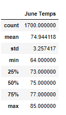
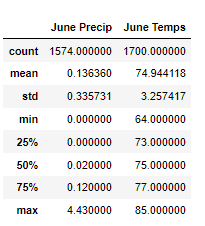
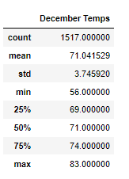
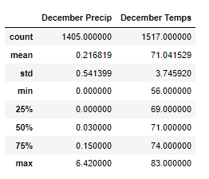
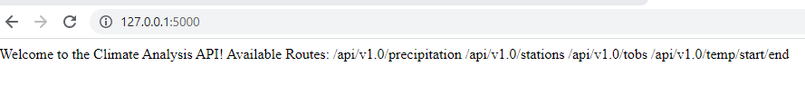
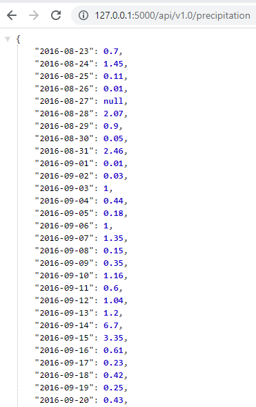
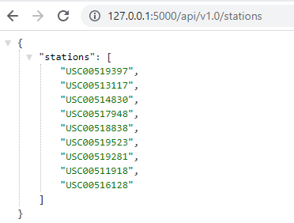
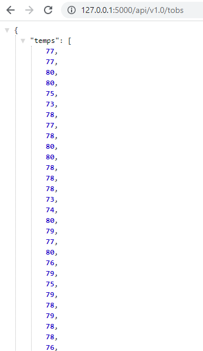
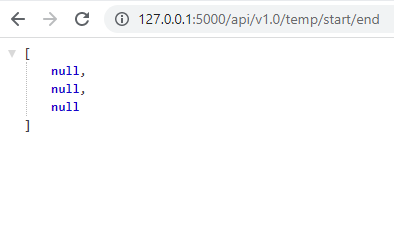
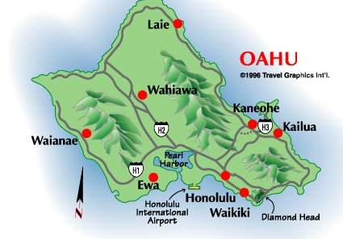

# Surfs_Up
## An analysis of a SQLite dataset containing 2017 weather data in Oahu, HI using Python to determine business sustainability based on climate trends. 

 

### Purpose

The purpose of this project is to create an analysis of year-round weather patterns in Oahu, Hawaii to determine the sustainability of a potential business venture. The success of the prospective business in question, an ice-cream and surf shop, would be heavily reliant on the weather of the area it would be started in. A statistical analysis was conducted using recorded weather data from 2017, focusing specifically on the months of June and December. The analysis presented data indicating that the climate in Oahu, HI is temperate and consistent year-round, showing little deviation from its average of 71 to 74 degrees Fahrenheit. Further analysis indicated that precipitation averages remained low as well, ranging from .13 mm to .23mm throughout the year. With Python & Jupyter Notebook(Pandas, NumPy and SQLalchemy dependencies), a script was written that used a SQLite dataset to creating tables wherein the analysis below was conducted. 

#### Datasets

* hawaii.sqlite

#### Resources

* Visual Studio Code 1.70.2
* Python 3.7.9 (Dependencies: Pandas, NumPy, SQLalchemy)
* Conda 4.13.0
* Anaconda Navigator 2.2.7
* Jupyter Notebook 6.4.8
* Flask 2.2.2, Werkzeug 2.2.2
* SQLite3

### Results

During the analysis of 2017 weather data for June of 2017 in Oahu, HI, the following observations could be made:

* The average temperature is 75 degrees Fahrenheit. 
* With a standard deviation of only 3.25, the viewer can conclude that most days stay in proximity of the average temperature. This indicates that the weather stays very consistent.  
* High temperatures of 85 degrees and low temperatures of 64 degrees further conclude that even on outlier days of minimum and maximum reported temperatures, the weather remains temperate.
* Precipitation averages at .14 mm throughout the month of June, indicating there is not much rain during this time of the year. 
* Precipitation lows of 0.0 and highs of 4.43 inches can be seen with a direct correlation between the higher temperatures and rainfall.  

 

During the analysis of 2017 weather data for December of 2017 in Oahu, HI, the following observations could be made:

* The average temperature is 71 degrees Fahrenheit. 
* With a standard deviation of only 3.74, the viewer can conclude that most days stay in proximity of the average temperature. This indicates that the weather stays very consistent, although a few degrees colder than June with a slightly higher standard deviation. 
* High temperatures of 83 degrees and low temperatures of 56 degrees further conclude that even on outlier days of minimum and maximum reported temperatures, the weather remains temperate. A noticeable drop in the low temperature from 64 to 56 degrees is observed.
* Precipitation averages at .21 mm throughout the month of December, indicating there is not much rain during this month despite the increase from June.  
* Precipitation lows of 0.0 and highs of 6.42 inches can be seen with a direct correlation between the higher temperatures and rainfall. 

 

### Flask API Analysis

In addition to the analysis above, a Flask API was designed based on queries developed during this analysis. The following routes were created and listed on the home page (Screenshot of home page below):

*  /api/v1.0/precipitation: query results were converted into a dictionary that used date as the key and prcp as the value. The results were jsonified into a list.

*  /api/v1.0/stations: resulted in a jsonified list of weather stations

*  /api/v1.0/tobs: generated a query of dates and temperature observations from the most active station for the last year of data recorded. A jsonified list was returned.

* /api/v1.0/<start> and /api/v1.0/<start>/<end>: Returned jsonified lists of minimum temperatures, average temperatures and max temperatures for a given start and end range (Note: the values are null below because start and end dates were not specified).
 

### Conclusion
  
 

In conclusion, it would be safe to assume that the weather would not be a deterring factor in opening an ice-cream and surf business. Neither temperature nor rain are likely to impact this business’s success. In the future, further analysis could be conducted to include a wider timeframe, such as five years, instead of a single year for a more conclusive analysis of the weather patterns. With this data set, additional analysis on the precipitation and temperatures could be conducted for the months of March and September to check for rainy seasons and inclement weather. To increase profitability of the potential business, a market analysis could be conducted that analyzed business trends for the other surf and ice cream shops of Oahu, HI, as well as in other islands. With additional analysis, such as this project studying weather patterns, a business model could be built and implemented for the new shop that optimized its chance for growth and success.
